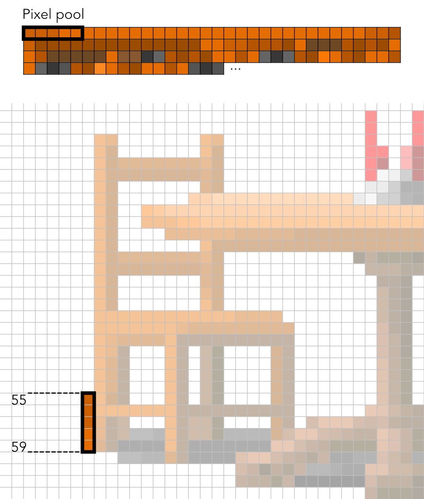
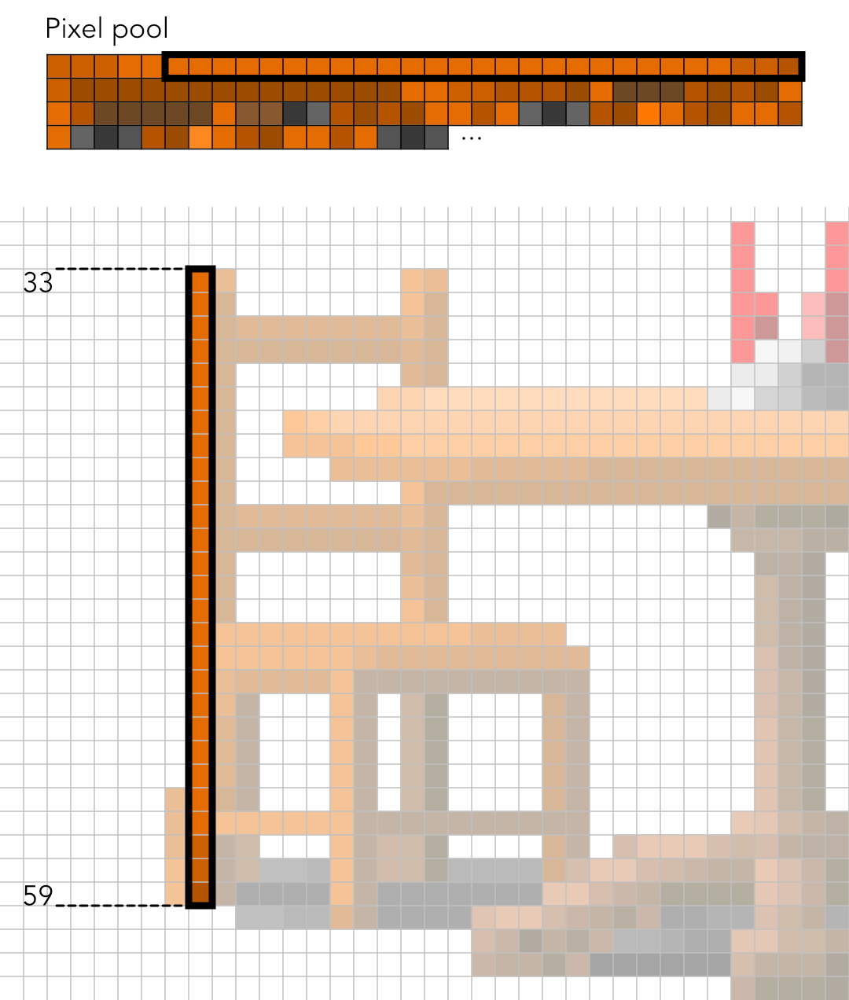
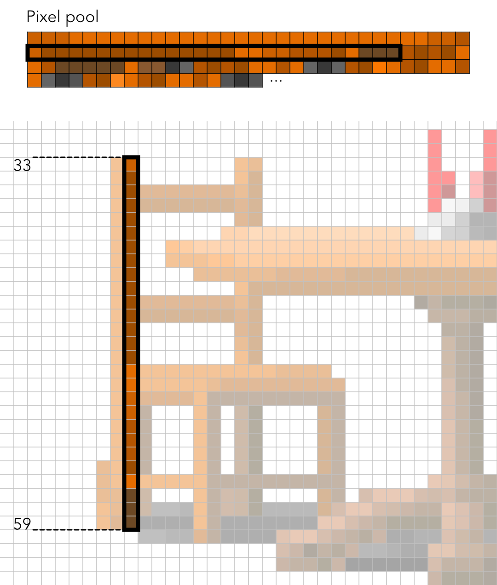
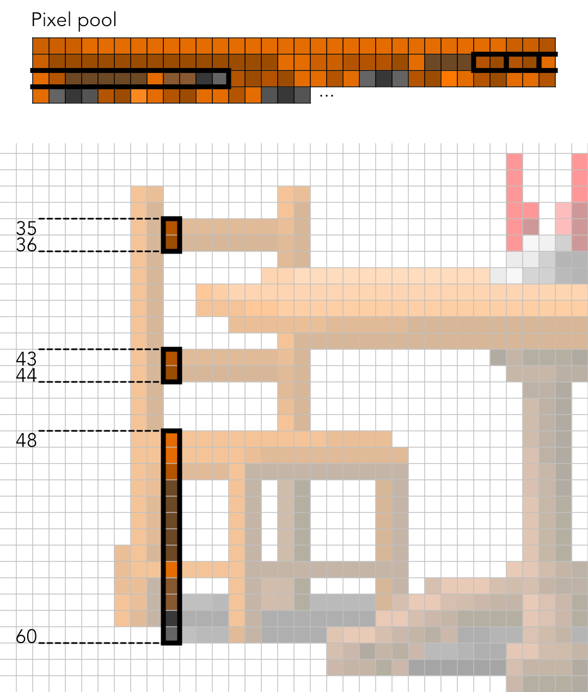

# Wolfenstein 3D game file specifications

Most of the information on this page is taken from Gaarabis's page (no longer available) and the [Wolfenstein wiki](https://wolfenstein.fandom.com/wiki/Wolfenstein_Wiki).

Three files are used in this project:
- `VSWAP.WL6` contains the wall textures, the sprite graphics (also the sound effects but not used in this project);
- `GAMEMAPS.WL6` contains the map data for all levels (walls, enemies, objects, etc.);
- `MAPHEAD.WL6` contains a list of offsets to the data for each level in the `GAMEMAPS.WL6` file.

**Note:** In all files, all multi-byte integers are stored in **little-endian** format.

## Compression

Most of the data in the game files is compressed. Two algorithms are used

### Row-Length Encoding Word (RLEW) Compression

Row-length encoding is a commonly used compression algorithm. The general idea is that sequences of identical symbols are represented by giving the number of repetitions followed by the symbol, which saves space for files containing long sequences of repeated symbols. In the case of RLEW, the considered symbols are *words* (UInt16LE).

A special UInt16LE value (*RLEW tag*) is used to indicate a repeated value (for Wolfenstein 3D, the tag is the first word in `MAPHEAD.WL6`, which is 0xABCD). The decoding algorithm is:
- Read first 2 bytes of input file. This is the total length in bytes of the decoded data
- While the decoded data length is less than the total length (or while there are bytes to decode):
    - read a word *w*
    - if the word is the RLEW tag, read two more words *w1* and *w2*, repeat *w1* times the word *w2* in the output
    - otherwise, write *w* in the output

See function `rlewDecode` in `js/files.js` for an implementation.

### Carmack Compression

Carmack compression is an algorithm designed by John Carmack for ID Soft games. The idea is to identify repeating patterns in the data to compress and when such a repetition is found, to describe the repeated pattern by pointing to its previous appearance. Although this idea is similar to Lempel-Ziv compression, pointers to previous patterns are encoded in a more complicated way. There are *near pointers* and *far pointers*.

Near pointers point to an address relative to the current decoding position. The offsets for near pointers are only one byte long so they can only point to one of the last 255 previously decoded words. Far pointers are absolute addresses from the start of the decoded data (but they point to *words* so the address in bytes is twice the represented value). Their offsets are encoded on 2 bytes.

As with RLEW-encoding the first word represents the total length in bytes of the decoded data. After this, while there is data to be read (or while the decoded data length is less than the total expected length):
- read two bytes *x* and *y*
- if *y* is neither 0xA7 nor 0xA8, append the word *xy* to the output (no pointer)
- if *y* is 0xA7, it indicates a near pointer. In that case, an extra byte *z* should be read that indicates the offset in words (counted backwards from the current location in the output) where the repeated sequence starts. *x* words should be appended to the output from that position.
- if *y* is 0xA8, it indicates a far pointer. An extra word *w* should be read that indicates the absolute offset in words from which the repeated sequence starts. *x* words should be appended to the output from that absolute position.

**Note:** Because 0xA7 and 0xA8 have special meaning, a special case is used to represent directly words that have one of these as second byte: an exception is recognized when *x* = 0 and *y* = 0xA7 or 0xA8. In that case an extra byte *z* is read and the word *zy* is appended to the output.

See function `carmackDecode` in `js/files.js` for an implementation.

## MAPHEAD.WL6

This very short file contains the *RLEW tag* used for all other RLEW-compressed files (it's 0xABCD) as well as offsets to the data for each level in the `GAMEMAPS.WL6` file:

| Type          | Description
|---            |---
| UInt16LE      | RLEW tag
| UInt32LE[100] | Offsets for levels 00 to 99 in `GAMEMAPS.WL6`

**Note:** Levels in Wolfenstein 3D are grouped into episodes. Each episode has 9 regular levels and one secret level. The original game had 3 episodes but later versions contained 3 more (the *Nocturnal Missions*) for a total of 6 episodes. Levels are numbered from 00 to 59 (first digit for the episode, second for the level number, 9 being the secret level). The `MAPHEAD.WL6` file always has 100 pointers but the ones for which the game has no map are zeroes.

## GAMEMAPS.WL6

Each level is represented by two 64x64 grids of values. The first (plane 0) contains positions and types of walls, doors and "sectors" (floor tiles are indexed and grouped as rooms). The second (plane 1) contains information for *things* (collectibles, enemies, sprites, pushwalls, etc.). Some other ID Soft games use a third grid to describe levels (plane 2) so there are pointers to it in the level headers but it is never used in Wolfenstein 3D. Each plane data is compressed by RLEW compression followed by Carmack compression.

Because all planes are 64x64 grids containing 2-byte values, the decompressed data for each plane should be 8192 bytes long. Values are stored from left to right, top to bottom (the first value is the top left corner, followed by all values in the top line, and ending with the bottom right corner).

### Headers

The address for each level in `MAPHEAD.WL6` points to a 42-bytes header in `GAMEMAPS.WL6` containing the following information:

| Type     | Description
|---       |---
| UInt32LE | Offset in file of plane 0 compressed data
| UInt32LE | Offset in file of plane 1 compressed data
| UInt32LE | Offset in file of plane 2 compressed data (unused)
| UInt16LE | Size in bytes of plane 0 compressed data
| UInt16LE | Size in bytes of plane 1 compressed data
| UInt16LE | Size in bytes of plane 2 compressed data (unused)
| UInt16LE | Width of the level grid (always 64)
| UInt16LE | Height of the level grid (always 64)
| Char[16] | 0-terminated name of the map (for instance "Wolf3 Map1")

### Plane 0

Plane 0 contains structural information for each cell of the level. Each cell can either be a wall, a door, an elevator (end of level) or a walkable tile (floor).

The value of a wall is used to determine the graphic texture in the `VSWAP.WL6` file to use by the engine when representing the wall. Each door type has two indexes to indicate its direction. An even index corresponds to a door along the North/South axis (player moves through it along the East/West axis) and an odd index to a door along the East/West axis.

The value of a walkable tile is used to represent "rooms", but it is only used for enemy AI (the Wolfenstein 3D engine doesn't represent textures on floors and ceilings).

Possible values for plane 0 tiles:

| Value     | Description
|---        |---
| 000 - 063 | Walls
| 090 - 091 | Regular unlocked door (oriented)
| 092 - 093 | Gold-locked door (oriented)
| 094 - 095 | Silver-locked door (oriented)
| 100 - 101 | Elevator door (oriented)
| 106 - 143 | Walkable tile (room)

### Plane 1

Plane 1 contains locations for "things" (enemies, collectibles, or "decorative" props) or special properties (secret pushwalls, player spawn location). Some of these can be oriented, in which case they can have 4 consecutive possible values, corresponding to orientations North, East, South and West respectively.

| Value     | Description
|---        |---
| 019 - 022 | Player spawn (oriented)
| 023 - 070 | Props
| 029       | Dog food
| 043 - 044 | Key (silver, gold)
| 047       | Food
| 048       | Medkit
| 049       | Ammo clip
| 050       | Machine gun
| 051       | Chaingun
| 052 - 055 | Treasure (cross, chalice, chest, crown)
| 056       | Life up
| 124       | Dead guard
| 098       | Pushwall
| 108 - 227 | Enemies

#### Props

Props are represented by values from 23 to 70 in plane 2. They exactly correspond to the sprites at indexes from 2 to 49 in `VSWAP.WL6` (prop with value *n* uses sprite at index (*n* - 21)). Most of the props are purely for decoration and can be walked through. However, the following props are blocking (the player can't step on the tile on which they are): 

| PropID    | Description
|---        |---
| 24        | Green barrel
| 25        | Table and chairs
| 26        | Floor lamp
| 28        | Hanged skeleton
| 30        | White pillar
| 31        | Tree
| 33        | Sink
| 34        | Potted plant
| 35        | Urn
| 36        | Bare table
| 39        | Suit of armor
| 40        | Hanging cage
| 41        | Skeleton in cage
| 45        | Bed
| 58        | Barrel
| 59        | Well
| 60        | Empty well
| 62        | Flag
| 63        | Call Apogee
| 68        | Stove
| 69        | Spears

#### Enemies

There are 5 types of regular enemies:
- Guard (brown uniform)
- Officer (white uniform)
- SS (blue uniform)
- Dog
- Mutant (green uniform and white skin)

Regular enemies can be oriented in any of the 4 cardinal directions. They can either be standing still (until they detect the player) or patrolling along a set course. Moreover, Wolfenstein 3D has 4 difficulty settings ("Can I play, Daddy?", "Don't hurt me.", "Bring 'em on!" and "I am Death incarnate"). Some enemies only appear in the first two difficulty settings (same enemies for both difficulties), some more appear on the third level and the last difficulty setting has even more enemies.

All in all, there are 24 possible values for each regular enemy type (4 directions x 2 patrolling states x 3 difficulty settings):

| Value     | Description
|---        |---
| 108 - 111 | Standing guard (oriented - Any difficulty)
| 116 - 119 | Standing officer (oriented - Any difficulty)
| 126 - 129 | Standing SS (oriented - Any difficulty)
| 134 - 137 | Standing dog (oriented - Any difficulty)
| 216 - 219 | Standing mutant (oriented - Any difficulty)
| 112 - 115 | Patrolling guard (oriented - Any difficulty)
| 120 - 123 | Patrolling officer (oriented - Any difficulty)
| 130 - 133 | Patrolling SS (oriented - Any difficulty)
| 138 - 141 | Patrolling dog (oriented - Any difficulty)
| 220 - 223 | Patrolling mutant (oriented - Any difficulty)
| 144 - 147 | Standing guard (oriented - Medium)
| 152 - 155 | Standing officer (oriented - Medium)
| 162 - 165 | Standing SS (oriented - Medium)
| 170 - 173 | Standing dog (oriented - Medium)
| 234 - 237 | Standing mutant (oriented - Medium)
| 148 - 151 | Patrolling guard (oriented - Medium)
| 156 - 159 | Patrolling officer (oriented - Medium)
| 166 - 169 | Patrolling SS (oriented - Medium)
| 174 - 177 | Patrolling dog (oriented - Medium)
| 238 - 241 | Patrolling mutant (oriented - Medium)
| 180 - 183 | Standing guard (oriented - Hard)
| 188 - 191 | Standing officer (oriented - Hard)
| 198 - 201 | Standing SS (oriented - Hard)
| 206 - 209 | Standing dog (oriented - Hard)
| 252 - 255 | Standing mutant (oriented - Hard)
| 184 - 187 | Patrolling guard (oriented - Hard)
| 192 - 195 | Patrolling officer (oriented - Hard)
| 202 - 205 | Patrolling SS (oriented - Hard)
| 210 - 213 | Patrolling dog (oriented - Hard)
| 256 - 259 | Patrolling mutant (oriented - Hard)

There are also some special enemies considered as bosses (or sub-bosses). These are always facing the player (so they are not oriented) and appear in all difficulty settings:

| Value     | Description
|---        |---
| 160       | Fake Hitler
| 178       | Hitler
| 179       | General Fettgesicht
| 196       | Doctor Schabbs
| 197       | Gretel Grosse
| 214       | Hans Grosse
| 215       | Otto Giftmacher
| 224       | Red Pac-Man ghost (Blinky)
| 225       | Pink Pac-Man ghost (Pinky)
| 226       | Orange Pac-Man ghost (Clyde)
| 227       | Blue Pac-Man ghost (Inky)

#### Example

Let's see how we can find the value in cell (49, 30) of Plane 1 in Floor 9 of Episode 3 (E3L9).

- E3L9 is level number 28, so read the UInt32LE in `MAPHEAD.WL6` at offset (2 + 28 * 4). It's 70103.
- Read the header at offset 70103 in `GAMEMAPS.WL6`. Because we want to decode Plane 1, read the UInt32LE at address (70103 + 4) and the UInt16LE at address (70103 + 14). The first is 69762 (offset of compressed data for plane 1) and the second is 331 (size of compressed data).
- Decompress the 331 bytes starting at address 69762 with Carmack and then RLEW. We obtain an array of 8192 bytes (which is the expected size of a decompressed level data).
- To get the element in cell (49, 30), read the UInt16LE at index (2 * (49 + 64 * 30)) in the array. It's 178, so Hitler is on that cell.

(see functions `loadLevel` and `map1` in `js/files.js`)

## VSWAP.WL6

This file contains all the wall textures, the sprite textures and the sounds for the game. It has a header describing its structure and a concatenation of *chunks* (each texture or sound corresponds to a chunk). First are all the wall chunks, followed by all the sprite chunks and at the end the sound chunks.

The data in this file is not compressed.

| Type          | Description
|---            |---
| UInt16LE      | Total number of chunks (wall textures + sprites + sounds) in the file
| UInt16LE      | Index of the first sprite chunk (= number of wall chunks)
| UInt16LE      | Index of the first sound chunk (= number of wall + sprite chunks)
| UInt32LE[n]   | Address at which each chunk starts (n = number of chunks)
| UInt16LE[n]   | Byte length of each chunk (n = number of chunks)

**Note:** The game uses a hard-coded color palette for wall textures and sprites. The palette contains 256 colors so each pixel in the textures is described as a single byte (the palette index for the pixel's color). See array `gamePalette` in `js/engine.js` for the actual RGBA values.

### Walls

Wall textures are uncompressed 64x64 pixels images. Since each pixel is represented by a single byte (palette index), all chunks are exactly 4069 bytes long. Because the engine renders walls column by column, texture pixels are organized by columns (more efficient to read when rendering). The first 64 bytes are the pixels from the first (leftmost) column (from top to bottom), the 64 next bytes are the pixels from the second column, and so on.

The color index for the pixel at coordinates (*col*, *row*) on a wall texture can therefore be found at offset (*chunkOffset* + 64 x *col* + *row*).

### Sprites

Sprites are 64x64 pixels images but because they can have transparent (not displayed) pixels they are represented in the file in a more complicated way which not only saves space but is also more efficient when rendering the sprites in-game.

Sprites are encoded column by column, but each column is described as a sequence of *posts*, which correspond to vertical segments consisting of "solid" pixels only. Columns are described from left to right, and posts in a column from top to bottom.

The data in a sprite chunk is organized as follows:

| Type          | Description
|---            |---
| UInt16LE      | *FirstCol*: Index of leftmost non-empty column
| UInt16LE      | *LastCol*: Index of rightmost non-empty column
| UInt16LE[n]   | Offsets relative to beginning of chunk to the first post of each column between *FirstCol* and *LastCol* (n = *LastCol* - *FirstCol* + 1)
| UInt8[?]      | Pixel pool: Palette indexes for all solid pixels of the sprite (size unknown when decoding)
| UInt16[?]     | Array of values describing all posts in the sprite (size unknown when decoding)

The posts are described column by column, from top to bottom. Each post is represented by 3 UInt16LE values. The first is twice the index of the row where the post ends (first row after the post) and the third is twice the index of the row at which the post starts. A column may have several posts (or none) and the end of a column's posts is indicated by the value 0 which is not a valid post end row (in which case only one value is read instead of 3).

All solid pixel values for the sprite (palette indexes) are written consecutively in the "pixel pool" section of the chunk in order from left to right and top to bottom.

Sprites are decoded by function `drawSprite` in `js/engine.js`.

**Note:** Posts are described by 3 values but the signification of the central one remains a mystery. All sources that I found (see [that](https://devinsmith.net/backups/bruce/wolf3d.html)) concur that it is probably some kind of offset to a segment of the pixel pool but none fully understands it. It is possible to ignore this value when decoding sprites if all posts of all columns are decoded sequentially from the first (in that case values are read from the pixel pool in order from the start). However, when doing so there is no need to read the offsets to the first post of each column. The fact that these offsets are in the file shows that the developers wanted a way to decode the posts of a given column without decoding the previous ones, and they most likely use the mystery value to jump to the corresponding position in the pixel pool.

Skipping columns entirely saves some time when rendering sprites that are partially hidden behind walls. Without this ability, posts from hidden columns still need to be decoded to count the number of pixels per column and skip the corresponding entries in the pixel pool.


#### Example

Let us consider the sprite of index 4 (table and chairs):


First, let's find the corresponding chunk. The first two bytes of `VSWAP.WL6` indicate that there are 663 chunks in the file, and the following two bytes that the first sprite is the chunk of index 106. The sprite of index 4 is therefore the chunk of index 110. We find its address by reading the UInt32LE at offset (6 + 4 * 110): it's 444416. Then its size is given by the UInt16LE at offset (6 + 4 * 663 + 2 * 110): it's 2050.

The two first UInt16LE in the chunk are 7 and 61 which means that column 7 is the leftmost one with solid pixels and 61 is the rightmost one (55 columns need to be described). The chunk then contains 55 offsets (UInt16LE) that point to the individual descriptions of each column:

```
07 00 3D 00 2E 04 36 04 3E 04 46 04 5A 04 7A 04 A0 04 C6 04 E0 04 FA 04 1A 05 22 05 2A 05 44 05 
5E 05 78 05 92 05 A0 05 AE 05 BC 05 CA 05 D8 05 E6 05 F4 05 02 06 10 06 18 06 20 06 28 06 36 06 
44 06 52 06 66 06 7A 06 8E 06 A8 06 C2 06 CA 06 D2 06 E6 06 FA 06 1A 07 3A 07 60 07 86 07 A0 07 
A8 07 B0 07 BE 07 CC 07 D4 07 DC 07 E4 07 EC 07 FA 07
```

The first of these offsets is 0x042E = 1070. Post descriptions therefore start 1070 bytes after the beginning of the chunk. Everything in between (bytes 114 to 1069) is the pixel pool (each of these bytes is an index in the game color palette):
 
```
3D 3D 3D 3C 3C 3C 3C 3C 3C 3C 3C 3C 3C 3C 3C 3C 3C 3C 3C 3C 3C 3C 3C 3C 3C 3C 3C 3C 3C 3D 3D 3E 
3D 3F 3F 3F 3F 3F 3F 3F 3F 3F 3F 3F 3F 3F 3F 3C 3C 3D 3D 3E 3E 3E 3F 3C D9 D9 D9 3E 3F 3E 3F 3C 
3C 3E D9 D9 D9 D9 D9 3C D6 D6 1D 1A 3E 3F 3E 3F 3C 3C 3E 3C 1A 1D 1A 3E 3F 3B 3E 3E 3F 3C 3C 3E 
3C 1A 1D 1B 3E 3F 3A 3C 3E 3F 3C 3C 3E 3C 1B 1D 1B 3E 3F 39 3C 3D 3E 3F 3C 3C 3C 3C 3C 3C 3C 3C 
3C 3C 3C 3C 3E 3E 3F 39 3B 3D 3E 3F 3C 3D D9 D9 D9 D9 D9 D9 D9 D9 D9 D9 D9 3E 3F 3C 39 3A 3D 3E 
3F 3C 3E D9 D9 D5 D5 1D 1D 3C 3C 3D 3E 3E 3B 39 39 3D 3C 3D 3E 3E 3D 3C 3C 3E D9 D6 D6 D6 D6 D6 
D9 D6 D6 1D 1D 3D 3F 3F 3F 3F 3B 39 38 3D 3F 3F 3F 3F 3F 3F 3C 3E D9 DC DC DC DC DC D9 DC DC 1D 
1D 3B 39 38 3D 3F 3C 3E D9 D9 1B 1D 1D 3B 39 38 3E 3F 3D 3E D9 D9 1B 1D D1 D4 D7 3B 39 38 3E 3F 
3D 3E D9 D9 1B 1D CF D7 D9 3B 39 38 3E 3F 3D 3E D9 D9 1B 1D CF DD D9 3B 39 38 3E 3F 3D 3E D9 3F 
3F 3F 3F 3F D9 3F 3F CF D4 D9 DC 3B 39 38 3E 3F 3E D9 D9 D9 D9 D9 D9 D9 D9 D4 CF D7 DB D7 3B 39 
38 3F 3F CF D4 D9 D7 1F 3B 39 38 3F 3F D4 CF D7 DB 1B 1F 3B 39 38 3F 3F CF D4 D9 D7 1B 1F 3B 39 
38 3F 3F CF D5 DC 1D 1C 1F 3B 39 38 3F 3F CF D7 DC 1D 1D 1F 12 39 38 3F 3F DD D4 D9 DC 1C 1D 1F 
20 20 20 20 20 20 12 10 39 38 3F 3F D9 D8 CF D5 D9 DC 1C D0 D4 D7 20 29 10 12 16 39 38 3F 3F DC 
D8 DA D6 D6 D6 D3 D3 D3 D1 D1 D1 D1 D0 D4 CF D0 D2 D0 D9 DC 11 17 17 39 38 3F 3F DC D8 DA DA DA 
DA DA D8 D8 D8 D8 D8 D8 D5 D9 D2 D2 D6 D5 D9 DC 34 34 17 1C 1B 39 38 3F 3F DC DB DD DD DD DD DD 
DD DD DC DC DC DC D9 DA D7 D7 D9 D6 D9 DC 37 37 37 29 29 29 1C 1C 39 38 3F 3F DE DB DA DA DC DC 
1C D9 DD DD 19 39 38 3F 3F DE 3C 3C 3C 3C 3C 3C 3C 3C D9 DA DC 1C 1F 1F 1D 3B 39 38 3F 3F 3E 3D 
3F 3F 3F 3F 3F 3F 3F D9 DA DC 1B 1F 1F 1D 3B 39 38 3F 3F 3E 3D 3F 3F D9 DA DC 1C 1F 1F 1D 3B 39 
38 3F 3F 3E 3E 3F 3F D9 DA DC DC 1F 1F 1D 3B 39 38 3F 3F 3E 3E 3F 3F D9 DA DA DC 1F 1F 1D 3B 39 
38 3F 3F D5 3E 3F 3F DB DA DC DC 1F 1D 3B 39 38 3F 3F D5 3E 3F 3F DB DA DA DC DC 1D 3C 3C 3C 3C 
3C 3B 39 38 3F 3F D8 D8 D8 D8 D8 D5 3E 3F D6 D6 D6 D6 D6 3F D6 D6 DB DA DA DC 1D 3F 3F 3F 3F 3F 
3B 39 38 3F 3F DB DB DB DB DB D5 3E 3F DB DB DB DB DB 3F DB DB DB DA DD DA 1D 3E 3F 3B 39 38 3F 
3F D8 D8 D5 D5 3F 3F 3F 3F 3F 3F 3F 3F 3F 3F DB DA DB 1D 3C 3D 3B 39 38 3F 3F D8 D8 D5 D5 D8 D8 
D8 D8 D8 D8 D8 D8 D8 D8 DB DB DB 1D 3C 3D 3B 39 38 3F 3F D8 D8 D5 D5 D8 D8 1B 1D 1F 00 1F 1D 3C 
3D 3B 39 39 3F 3F D8 D8 D5 D5 D8 D8 1B 1D 1F 00 1F 1D 3C 3D 3B 39 3B 3F D8 D8 D5 D5 D8 D8 1B 1D 
1F 00 1F 1D 3C 3D 3B 39 3C 3F D8 D8 D5 D5 D8 D8 1B 1D 1F 00 1F 1D 3C 3D 3C 39 3D 3F D8 D8 D5 D5 
D8 3F 3F 3F 3F 3E D8 3E 1B 1D 1F 00 1F 1D 3C 3C 3C 3C 3C 3C 3A 3E 3F D8 D8 D8 D8 D8 D8 D5 D8 D8 
D8 D8 D8 D8 D8 D8 D8 D8 DA 1F 00 1F 1D 3F 3F 3F 3F 3F 3F 3B 3E DB DB DB DB DB DB DB DB DB DB DB 
DB DB DB DB DB DB DB DB 1F 00 1F 1D 3C 3F D4 D4 D6 D6 DB 1F 00 1F 1D 3F D8 1B 1D 1F 00 1F 1C 1B 
1D 1F 1D 1F 1B 1B 1D 1D 1B 1D 1B 1B 1D 1B 1A 1C 1A 1B 1D 1A 1A 1B 1A 1A 1B 1A 1A 1A
```

And finally, all remaining bytes (from 1070 to 2049) are descriptions of the posts:

```
78 00 3B 00 6E 00 00 00 78 00 56 00 42 00 00 00 78 00 71 00 42 00 00 00 4A 00 8A 00 46 00 5A 00 
84 00 56 00 7A 00 81 00 60 00 00 00 4A 00 9B 00 46 00 5A 00 95 00 56 00 66 00 92 00 60 00 72 00 
8D 00 70 00 7A 00 8C 00 74 00 00 00 4A 00 A6 00 46 00 52 00 A4 00 4E 00 5A 00 A2 00 56 00 66 00 
9F 00 60 00 72 00 9A 00 70 00 7A 00 99 00 74 00 00 00 4A 00 B3 00 46 00 52 00 B1 00 4E 00 5A 00 
AF 00 56 00 66 00 AC 00 60 00 72 00 A7 00 70 00 7A 00 A6 00 74 00 00 00 4A 00 C0 00 46 00 54 00 
BE 00 4E 00 5A 00 BD 00 56 00 7A 00 BA 00 60 00 00 00 4A 00 D4 00 46 00 54 00 D2 00 4E 00 5A 00 
D1 00 56 00 7A 00 CE 00 60 00 00 00 4A 00 E8 00 46 00 54 00 E7 00 4C 00 5A 00 E6 00 56 00 66 00 
E3 00 60 00 7A 00 DE 00 70 00 00 00 7A 00 FA 00 42 00 00 00 7A 00 16 01 42 00 00 00 56 00 2D 01 
4C 00 66 00 28 01 60 00 72 00 23 01 70 00 7A 00 22 01 74 00 00 00 56 00 39 01 4C 00 66 00 34 01 
60 00 72 00 2F 01 70 00 7E 00 2E 01 74 00 00 00 56 00 47 01 4C 00 66 00 42 01 60 00 72 00 3D 01 
70 00 7E 00 3C 01 74 00 00 00 56 00 55 01 4C 00 66 00 50 01 60 00 72 00 4B 01 70 00 7E 00 4A 01 
74 00 00 00 56 00 63 01 4C 00 7E 00 5E 01 60 00 00 00 56 00 77 01 4C 00 7E 00 71 01 62 00 00 00 
56 00 8A 01 4C 00 7E 00 7B 01 74 00 00 00 56 00 94 01 4C 00 7E 00 86 01 72 00 00 00 56 00 9F 01 
4C 00 7E 00 91 01 72 00 00 00 56 00 AA 01 4C 00 7E 00 9C 01 72 00 00 00 56 00 B5 01 4C 00 7E 00 
A7 01 72 00 00 00 58 00 C0 01 4C 00 7E 00 B3 01 72 00 00 00 5A 00 D3 01 3E 00 80 00 C8 01 70 00 
00 00 80 00 E6 01 44 00 00 00 80 00 02 02 48 00 00 00 80 00 20 02 44 00 00 00 5A 00 41 02 3E 00 
80 00 36 02 70 00 00 00 58 00 50 02 4C 00 80 00 4B 02 62 00 00 00 56 00 65 02 4C 00 80 00 60 02 
60 00 00 00 56 00 7A 02 4C 00 66 00 75 02 60 00 80 00 70 02 70 00 00 00 56 00 8A 02 4C 00 66 00 
85 02 60 00 80 00 80 02 70 00 00 00 56 00 9A 02 4C 00 66 00 95 02 60 00 80 00 90 02 70 00 00 00 
56 00 AA 02 4C 00 66 00 A5 02 60 00 72 00 A0 02 70 00 80 00 9F 02 74 00 00 00 56 00 B9 02 4C 00 
66 00 B4 02 60 00 72 00 AF 02 70 00 80 00 AE 02 74 00 00 00 80 00 CD 02 42 00 00 00 80 00 EC 02 
42 00 00 00 4A 00 09 03 46 00 5A 00 08 03 4C 00 80 00 05 03 60 00 00 00 4A 00 22 03 46 00 5A 00 
21 03 4C 00 80 00 1E 03 60 00 00 00 4A 00 3B 03 46 00 5A 00 3A 03 4C 00 66 00 37 03 60 00 72 00 
32 03 70 00 80 00 31 03 74 00 00 00 4A 00 4E 03 46 00 5A 00 4D 03 4C 00 66 00 4A 03 60 00 72 00 
45 03 70 00 80 00 44 03 74 00 00 00 4A 00 61 03 46 00 54 00 60 03 4C 00 5A 00 5F 03 56 00 66 00 
5C 03 60 00 72 00 57 03 70 00 80 00 56 03 74 00 00 00 4A 00 73 03 46 00 54 00 72 03 4C 00 5A 00 
71 03 56 00 66 00 6E 03 60 00 72 00 69 03 70 00 80 00 68 03 74 00 00 00 4A 00 85 03 46 00 54 00 
84 03 4C 00 5A 00 83 03 56 00 80 00 80 03 60 00 00 00 80 00 9F 03 42 00 00 00 80 00 BE 03 42 00 
00 00 52 00 D7 03 4E 00 80 00 C9 03 6E 00 00 00 52 00 E2 03 4E 00 80 00 D1 03 74 00 00 00 80 00 
D7 03 74 00 00 00 80 00 DD 03 74 00 00 00 80 00 E3 03 74 00 00 00 80 00 E9 03 74 00 00 00 7A 00 
EF 03 74 00 7E 00 EE 03 7C 00 00 00 78 00 F2 03 76 00 00 00
```

These start with the posts from the first "solid" column (index 7). First values (UInt16LE) are 120, 59, 110, 0. This means that the first post starts at row 110 / 2 = 55 (included) and ends at row 120 / 2 = 60 (excluded). The colors for these pixels are the first 5 bytes of the pixel pool (`3D 3D 3D 3C 3C`). The value 0 indicates that there are no more posts in this column:



The following values in the posts descriptions are 120, 86, 66, 0. This is again a single-post column, with a post between rows 33 and 60. The colors of the pixels are the next 27 bytes of the pixel pool (`3C 3C 3C 3C 3C 3C 3C 3C 3C 3C 3C 3C 3C 3C 3C 3C 3C 3C 3C 3C 3C 3C 3C 3C 3D 3D 3E`):



Column 9 (values 120, 113, 66, 0) is similar to the previous one with a single post from rows 33 to 60. 27 more bytes are read from the pixel pool (`3D 3F 3F 3F 3F 3F 3F 3F 3F 3F 3F 3F 3F 3F 3F 3C 3C 3D 3D 3E 3E 3E 3F 3C D9 D9 D9`).



Column 10 is more interesting. Values are 74, 138, 70, 90, 132, 86, 122, 129, 96, 0. This describes 3 posts, from 35 to 37, from 43 to 45 and from 48 to 61. Two bytes are read from the pixel pool for the first post (`3E 3F`), two more for the second post (`3E 3F`) and 13 for the last post (`3C 3C 3E D9 D9 D9 D9 D9 3C D6 D6 1D 1A`):
  

